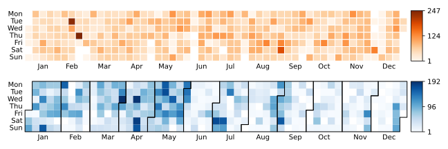
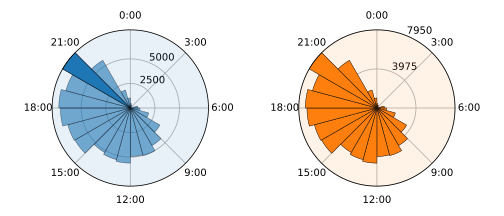
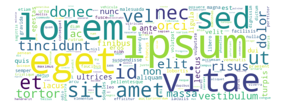

<picture>
  <source media="(prefers-color-scheme: dark)" srcset="doc/_static/logo-wide-dark.png">
  <source media="(prefers-color-scheme: light)" srcset="doc/_static/logo-wide-light.png">
  
</picture>

-----------------

# chat-miner: turn your chats into artwork

[](https://pypi.org/project/chat-miner/)
[](https://opensource.org/licenses/MIT)
[](https://pepy.tech/project/chat-miner)
[](https://codecov.io/gh/joweich/chat-miner)
[](https://github.com/psf/black)
[](https://pycqa.github.io/isort/)

**chat-miner** provides lean parsers for every major platform transforming chats into pandas dataframes. Artistic visualizations allow you to explore your data and create artwork from your chats.


## 1. Installation
Latest release including dependencies can be installed via PyPI:
```sh
pip install chat-miner
```

If you're interested in contributing, running the latest source code, or just like to build everything yourself:
```sh
git clone https://github.com/joweich/chat-miner.git
cd chat-miner
pip install -r requirements.txt
```

## 2. Exporting chat logs
Have a look at the official tutorials for [WhatsApp](https://faq.whatsapp.com/1180414079177245/), [Signal](https://github.com/carderne/signal-export), [Telegram](https://telegram.org/blog/export-and-more), [Facebook Messenger](https://www.facebook.com/help/messenger-app/713635396288741), or [Instagram Chats](https://help.instagram.com/181231772500920) to learn how to export chat logs for your platform.

## 3. Parsing
Following code showcases the ``WhatsAppParser`` module.
The usage of ``SignalParser``, ``TelegramJsonParser``, ``FacebookMessengerParser``, and ``InstagramJsonParser`` follows the same pattern.
```python
from chatminer.chatparsers import WhatsAppParser

parser = WhatsAppParser(FILEPATH)
parser.parse_file()
df = parser.parsed_messages.get_df()
```
## 4. Visualizing
```python
import chatminer.visualizations as vis
import matplotlib.pyplot as plt
```
### 4.1 Heatmap: Message count per day
```python
fig, ax = plt.subplots(2, 1, figsize=(9, 3))
ax[0] = vis.calendar_heatmap(df, year=2020, cmap='Oranges', ax=ax[0])
ax[1] = vis.calendar_heatmap(df, year=2021, linewidth=0, monthly_border=True, ax=ax[1])
```

<p align="center">
  
</p>

### 4.2 Sunburst: Message count per daytime
```python
fig, ax = plt.subplots(1, 2, figsize=(7, 3), subplot_kw={'projection': 'polar'})
ax[0] = vis.sunburst(df, highlight_max=True, isolines=[2500, 5000], isolines_relative=False, ax=ax[0])
ax[1] = vis.sunburst(df, highlight_max=False, isolines=[0.5, 1], color='C1', ax=ax[1])
```

<p align="center">
  
</p>

### 4.3 Wordcloud: Word frequencies
```python
fig, ax = plt.subplots(figsize=(8, 3))
stopwords = ['these', 'are', 'stopwords']
kwargs={"background_color": "white", "width": 800, "height": 300, "max_words": 500}
ax = vis.wordcloud(df, ax=ax, stopwords=stopwords, **kwargs)
```
<p align="center">
  
</p>

### 4.4 Radarchart: Message count per weekday
```python
if not vis.is_radar_registered():
	vis.radar_factory(7, frame="polygon")
fig, ax = plt.subplots(1, 2, figsize=(7, 3), subplot_kw={'projection': 'radar'})
ax[0] = vis.radar(df, ax=ax[0])
ax[1] = vis.radar(df, ax=ax[1], color='C1', alpha=0)
```
<p align="center">
  
</p>

## 5. Natural Language Processing

### 5.1 Add Sentiment 

```python
from chatminer.nlp import add_sentiment

df_sentiment = add_sentiment(df)
```
### 5.2 Example Plot: Sentiment per Author in Groupchat

```python
df_grouped = df_sentiment.groupby(['author', 'sentiment']).size().unstack(fill_value=0)
ax = df_grouped.plot(kind='bar', stacked=True, figsize=(8, 3))
```

<p align="center">
  
</p>


## 6. Command Line Interface
The CLI supports parsing chat logs into csv files.
As of now, you **can't** create visualizations from the CLI directly.

Example usage:
```bash
$ chatminer -p whatsapp -i exportfile.txt -o output.csv
```

Usage guide:
```
usage: chatminer [-h] [-p {whatsapp,instagram,facebook,signal,telegram}] [-i INPUT] [-o OUTPUT]

options:
  -h, --help 
                        Show this help message and exit
  -p {whatsapp,instagram,facebook,signal,telegram}, --parser {whatsapp,instagram,facebook,signal,telegram}
                        The platform from which the chats are imported
  -i INPUT, --input INPUT
                        Input file to be processed
  -o OUTPUT, --output OUTPUT
                        Output file for the results
```