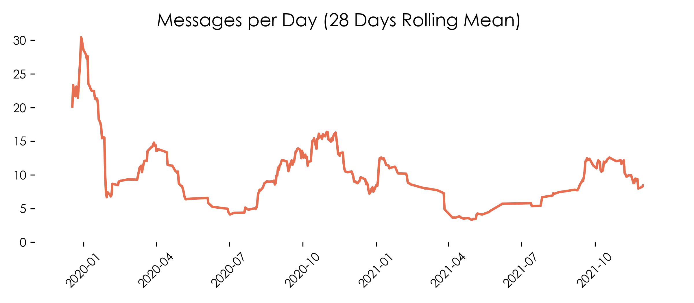

## Getting your data
To export a chat:
 - Go to the app
 - Go to Settings/Chats/Chat History
 - Tap *Export chat*
 - Select the chat you want to export

---

 ## Necessary Adjustments
 
 Depending on different factors, WhatsApp exports the datetime of messages in different formats. Therefore, you need to look up your format and adjust the respective parameter when calling
 ```python
get_df_from_chatlog(filepath, dateformat='mm/dd/yy', timeformat='24-hh:mm')
```

---

## Examples



