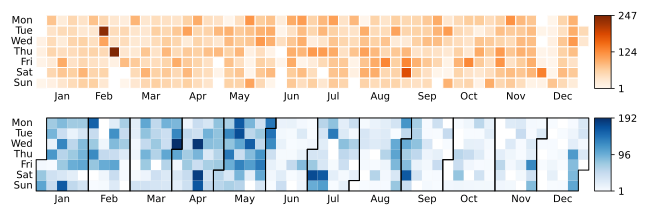
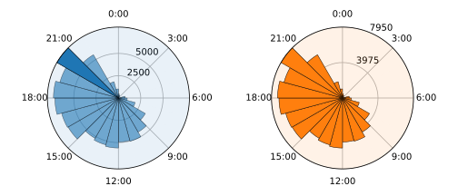
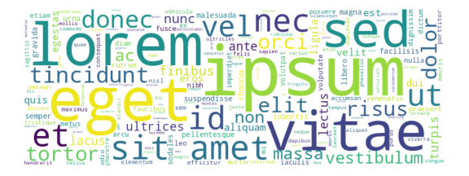

# chat-miner: turn your chats into artwork

[](https://opensource.org/licenses/MIT)
[](https://github.com/psf/black)

**chat-miner** provides lean parsers for every major platform transforming chats into pandas dataframes. Artistic visualizations allow you to explore your data differently and create artwork from your chats.


## 1. Installation
```sh
git clone https://github.com/joweich/chat-miner.git
cd chat-miner
pip install -r requirements.txt
```

## 2. Exporting chat logs
Have a look at the official tutorials for [WhatsApp](https://faq.whatsapp.com/196737011380816/?cms_id=196737011380816&published_only=true), [Signal](https://github.com/carderne/signal-export), [Telegram](https://telegram.org/blog/export-and-more), or [Facebook Messenger](https://www.facebook.com/help/messenger-app/713635396288741?cms_id=713635396288741&published_only=true) to learn how to export chat logs for your platform.

## 3. Parsing
Following code showcases the ``WhatsAppParser`` module.
The usage of ``SignalParser``, ``TelegramJsonParser``, and ``FacebookMessengerParser`` follows the same pattern.
```python
from chatminer.chatparsers import WhatsAppParser

parser = WhatsAppParser(FILEPATH)
parser.parse_file_into_df()
```
## 4. Visualizing
```python
import chatminer.visualizations as vis
import matplotlib.pyplot as plt
```
### 4.1 Heatmap: Message count per day
```python
fig, ax = plt.subplots(2, 1, figsize=(9, 3))
ax[0] = vis.calendar_heatmap(parser.df, year=2020, cmap='Oranges', ax=ax[0])
ax[1] = vis.calendar_heatmap(parser.df, year=2021, linewidth=0, monthly_border=True, ax=ax[1])
```


### 4.2 Sunburst: Message count per daytime
```python
fig, ax = plt.subplots(1, 2, figsize=(7, 3), subplot_kw={'projection': 'polar'})
ax[0] = vis.sunburst(parser.df, highlight_max=True, isolines=[2500, 5000], isolines_relative=False, ax=ax[0])
ax[1] = vis.sunburst(parser.df, highlight_max=False, isolines=[0.5, 1], color='C1', ax=ax[1])
```


### 4.3 Wordcloud: Visualize word frequencies
```python
fig, ax = plt.subplots(figsize=(8, 3))
stopwords = ['these', 'are', 'stopwords']
kwargs={"background_color": "white", "width": 800, "height": 300, "max_words": 500}
ax = vis.wordcloud(parser.df, ax=ax, stopwords=stopwords, **kwargs)
```

