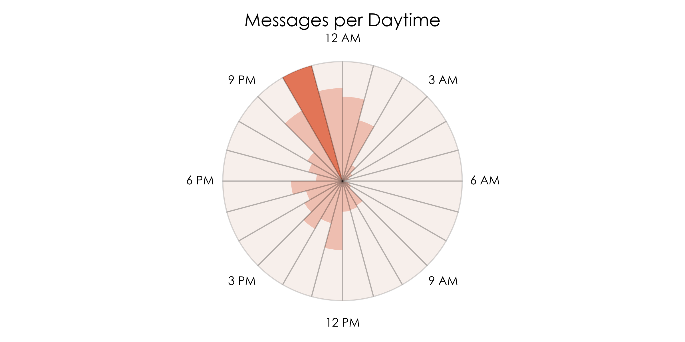
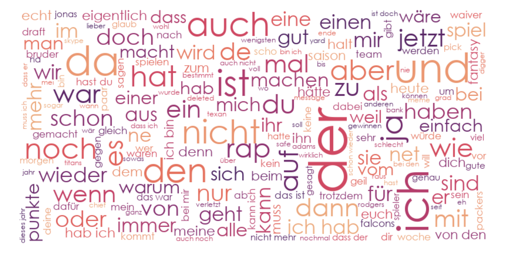
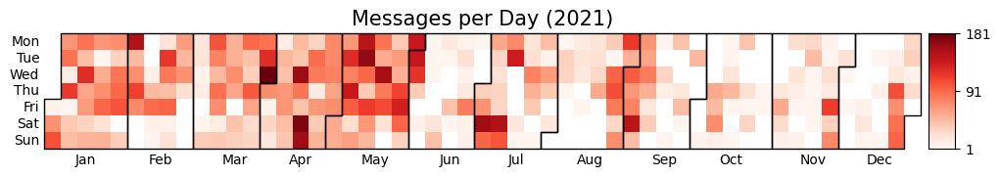

# chat-miner: parsing of chat histories

[](https://opensource.org/licenses/MIT)
[](https://github.com/psf/black)

chat-miner parses chat logs into a pandas dataframe.
As of now, **WhatsApp**, **Signal**, **Telegram**, and **Facebook Messenger** export files are supported.

## Export chat data
[WhatsApp (via mobile app)](https://faq.whatsapp.com/196737011380816/?cms_id=196737011380816&published_only=true)

[Signal (via desktop app)](https://github.com/carderne/signal-export)

[Telegram (via desktop app)](https://telegram.org/blog/export-and-more)

[Facebook Messenger (via mobile app)](https://www.facebook.com/help/messenger-app/713635396288741?cms_id=713635396288741&published_only=true)

## Usage
Following code showcases the ``WhatsAppParser`` module.
The usage of ``SignalParser``, ``TelegramJsonParser``, and ``FacebookMessengerParser`` follows the same pattern.
```python
from chatminer.chatparsers import WhatsAppParser

parser = WhatsAppParser(FILEPATH)
parser.parse_file_into_df()
print(parser.df.describe())
```
## Example visualizations
```python
import chatminer.visualizations as vis
vis.sunburst(parser.df)
```


```python
import chatminer.visualizations as vis
stopwords = ['media', 'omitted', 'missed', 'voice', 'call']
vis.wordcloud(parser.df, stopwords)
```


```python
import chatminer.visualizations as vis
vis.calendar_heatmap(parser.df,2022)
plt.show()
```

